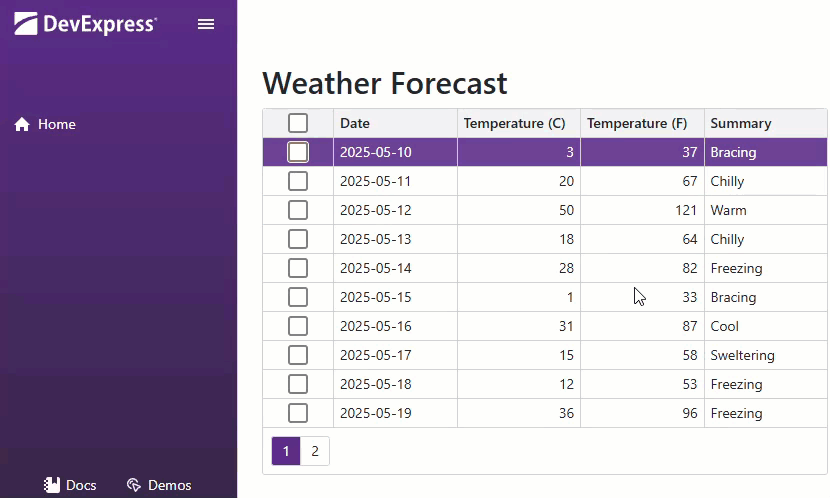

<!-- default badges list -->

<!-- default badges end -->
# Blazor Grid - Custom Keyboard Shortcuts

The DevExpress Blazor [Grid](https://docs.devexpress.com/Blazor/403143/components/grid) supports a number of keyboard shortcuts out-of-the-box. You can also define custom key combinations to further enhance interaction speed and streamline workflows according to business requirements or user preferences.

This example binds custom keyboard shortcuts to the Grid component:

- <kbd>Ctrl</kbd> + <kbd>A</kbd>: select all rows
- <kbd>Shift</kbd> + <kbd>Enter</kbd>: open row details

> [!NOTE]
> For keyboard shortcuts to operate, the Grid component must be focused. To bring the grid into focus, click anywhere within its area.

## Implementation Details

Add [DxGrid](https://docs.devexpress.com/Blazor/DevExpress.Blazor.DxGrid) and [DxPopup](https://docs.devexpress.com/Blazor/DevExpress.Blazor.DxPopup) components to the [page](CS/GridCustomShortcuts/Components/Pages/Index.razor). The popup will display the selected cell's details when a user presses <kbd>Shift</kbd> + <kbd>Enter</kbd>.

Create a [JavaScript file](CS/GridCustomShortcuts/Components/Pages/Index.razor.js) in the project. This file implements the following functions for managing keyboard shortcuts:

- `addCaptureKeyListener` - Attaches a keyboard event listener to the grid and defines custom shortcuts. To prevent default web browser actions for the same key combinations, call `event.stopPropagation();` within the event handler.
- `removeCaptureKeyListener` - Removes the previously attached keyboard event listener.
- `focusGrid` - Focus the grid programmatically on page load. This ensures shortcuts are instantly available.

### Bind JavaScript with .NET Code

In the `@code` section of the [Index.razor](CS/GridCustomShortcuts/Components/Pages/Index.razor) page:

1. Register the JavaScript code in `OnAfterRenderAsync` lifecycle method.
2. Call the `focusGrid` JavaScript function.
3. Call the `addCaptureKeyListener` JavaScript function. Pass the `DotNetObjectReference` (for interoperability from JavaScript to .NET) and a reference to the `
` element that surrounds the grid (for capturing keyboard events.)
4. Implement `SelectAllRows` and `HandleKeyDown` JSInvokable methods to handle operations triggered by keyboard shortcuts.

For technical details, read [this article](https://learn.microsoft.com/en-us/aspnet/core/blazor/javascript-interoperability/call-dotnet-from-javascript).

### Release Resources

In the `@code` section of the [Index.razor](CS/GridCustomShortcuts/Components/Pages/Index.razor) page, implement a `DisposeAsync` method. It removes the keyboard event listener, cleans up JavaScript resources, and frees allocated memory.

For technical details, read [this article](https://learn.microsoft.com/en-us/dotnet/standard/garbage-collection/implementing-disposeasync).

## Files to Review

- [Index.razor](CS/GridCustomShortcuts/Components/Pages/Index.razor)
- [Index.razor.js](CS/GridCustomShortcuts/Components/Pages/Index.razor.js)

## Documentation

- [Keyboard Support in Blazor Grid](https://docs.devexpress.com/Blazor/404652/components/grid/keyboard-support)
- [DxGrid Class](https://docs.devexpress.com/Blazor/DevExpress.Blazor.DxGrid)
- [DxPopup Class](https://docs.devexpress.com/Blazor/DevExpress.Blazor.DxPopup)

<!-- feedback -->
## Does this example address your development requirements/objectives?

 

(you will be redirected to DevExpress.com to submit your response)
<!-- feedback end -->
